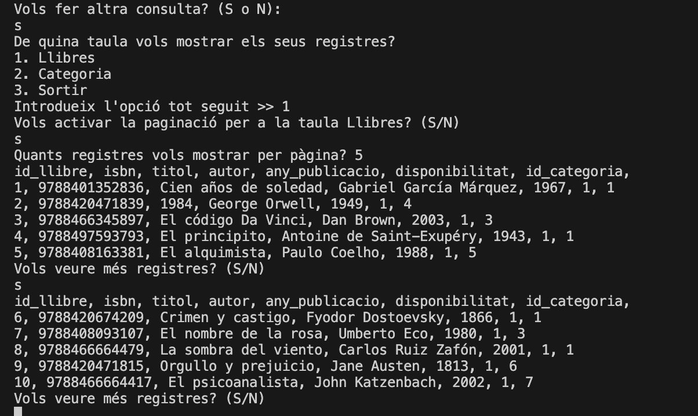

# Aplicació de Gestio de Biblioteca

## **Descripció**

Aquesta aplicació gestiona una biblioteca utilitzant una base de dades relacional amb funcionalitats per a llibres, categories, usuaris i bibliotecaris. El projecte està implementat en **Java** fent servir **JDBC** per interactuar amb la base de dades **MariaDB**.

## **Característiques Principals**

- Crear, llegir, actualitzar i eliminar llibres (CRUD complet).
- Consultar llibres per categoria o cercar amb criteris LIKE.
- Paginar resultats de consultes per a una millor experiència.
- Gestionar categories, bibliotecaris i zones.
- Generar dades inicials amb scripts SQL.

## **Requisits Previs**

- **Java JDK 8** o superior.
- **MariaDB** o **MySQL**.
- Client SQL com **DBeaver** o **MySQL Workbench** (opcional).
- Maven instal·lat (per gestionar dependències).

### Dependències Maven

- `mysql-connector-java`
- `jline-terminal`

## **Configuració de l'Entorn**

1. Clona el repositori:

   ```bash
   git clone https://github.com/alexgpareja/M6-UF2-Activitat2.git
   ```

2. Instal·la i configura Mariadb o algun altra base de dades:

3. Configura l'arxiu `config.properties` amb les credencials de la teva base de dades:

   ```properties
   db.url=jdbc:mysql://localhost:3306/
   db.username=usuari
   db.password=contrasenya
   ```

4. Executa el programa desde algun editor (com VSCode) fent play en la clase GestioDBHR.java

## **Instruccions d'Us**

Segueix les instruccions del menú principal per interactuar amb la base de dades.

1. CARREGAR LES DADES
   Executa el scripts d'inserts per carregar les dades a la database.
   
   
2. CONSULTAR TOTES LES DADES
   Permet mostrar tots els registres inserits de Llibres o Categories.
   Es pot escollir el mode de visualització, pàginat (a elecció de l'usuari) o tot seguit.
   
   
3. ALTRES CONSULTES
   Permet cercar un llibre per isbn, per coincidencia de titol, o una categoria per id.
   
   
   
   Si no troba cap coincidencia, ho indica:
   

4. INSERIR NOU LLIBRE
   Permet inserir un nou llibre a la base de dades.
   
   Si el llibre ja existeix (ja hi ha un llibre amb aquest isbn) no permetrà afegir-lo duplicat:
   

5. ACTUALITZAR LLIBRE
   

6. ELIMINAR LLIBRE
   Permet eliminar un llibre pel seu ISBN.
   
   Si no existeix el llibre
   

7. GENERAR XML
   Genera un xml mitjançant DOM de tots els registres de la base dades.
   

## **Estructura del Projecte**

- **src/main/java**
  - `GestioDBHR`: Classe principal que conté el menú i la lògica de navegació.
  - `CRUD`: Conté totes les operacions CRUD per a llibres, categories, etc.
  - `Utils`: Metodes auxiliars com paginació o validacions.
  - `FitxerXML`: Permet generar un XML a partir d'una connexió.
- **src/main/resources**
  - `config.properties`: Credencials de la base de dades.
  - `scripts/DB_Schema.sql`: Script per crear les taules.
  - `scripts/DB_Data.sql`: Script per inserir dades inicials.

### Creació de Taules

Consulta el fitxer `DB_Schema.sql` per a la definició completa de les taules.

```sql
CREATE TABLE IF NOT EXISTS Categoria (
    id_categoria INT AUTO_INCREMENT PRIMARY KEY,
    nom_categoria VARCHAR(50) NOT NULL
);

CREATE TABLE IF NOT EXISTS Llibres (
    id_llibre INT AUTO_INCREMENT PRIMARY KEY,
    isbn BIGINT UNIQUE,
    titol VARCHAR(50) NOT NULL,
    autor VARCHAR(50) NOT NULL,
    any_publicacio INT NOT NULL,
    disponibilitat TINYINT NOT NULL,
    id_categoria INT,
    FOREIGN KEY (id_categoria) REFERENCES Categoria(id_categoria)
);
```

### Dades Inicials

Consulta el fitxer `DB_Data.sql` per a dades préviament configurades.
